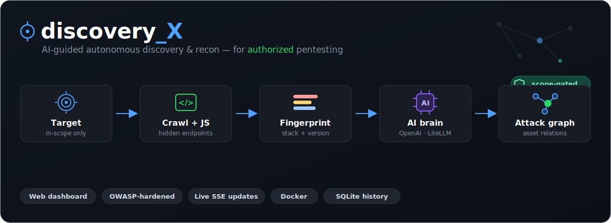

<h1 align="center">discovery_X</h1>

<p align="center">
  
</p>

**Agen discovery/recon otonom untuk pentesting terautorisasi**, dikendalikan penuh dari
dashboard web. Mengumpulkan permukaan serangan sebuah target lalu memakai AI untuk
menyimpulkan endpoint tersembunyi — dengan guardrail scope yang ketat.

**Kemampuan inti:**
- 🔎 **Temukan hidden endpoint** — crawl HTML + analisis JavaScript (file & inline) untuk
  menggali path/endpoint yang tak tertaut; berjalan dengan **atau tanpa** AI.
- 🧬 **Fingerprint stack + versi** (WordPress, Next.js, Laravel, nginx, …) lalu **dirbust
  terarah** ke path khas tiap teknologi.
- ✅ **Verifikasi liveness** (deteksi *soft-404*) & **render SPA** via headless browser.
- 🤖 **AI brain multi-provider** — endpoint OpenAI-compatible apa pun, atau proxy **LiteLLM**
  untuk OpenAI / Anthropic / Gemini / Ollama / dll.
- 🕸️ **Attack graph interaktif** — petakan relasi aset; endpoint hasil inferensi AI ditonjolkan.
- 🖥️ **Dashboard web (OWASP-hardened)** — tiap temuan menampilkan **stack + versi**,
  **HTTP status code**, server, judul, dan status hidup/mati. Riwayat scan tersimpan.
- 🐳 **Deploy satu perintah** dengan Docker (Chromium + Graphviz sudah termasuk).

> ⚠️ **Hanya untuk target yang Anda berwenang menyentuhnya.** Tiap scan mewajibkan
> scope allowlist + centang konfirmasi otorisasi; seed di luar scope ditolak.
> Penggunaan tak-terautorisasi ilegal.

Desain & latar belakang arsitektur: lihat [`discovery.md`](./discovery.md).

---

## Mulai cepat dengan Docker (disarankan)

Tidak perlu pasang Rust/Node/Chromium di host — semuanya di dalam image.

```bash
# 1. Buat hash password admin (server menolak start tanpa ini).
docker compose run --rm discovery_x hash-password
#    → ketik password, salin baris hash "$argon2id$..."

# 2. Simpan kredensial di file .env di sebelah docker-compose.yml.
#    PENTING: bungkus hash dengan KUTIP TUNGGAL — '$' akan diinterpolasi
#    oleh Compose bila tidak dikutip, sehingga hash jadi rusak.
cat > .env <<'EOF'
DISCOVERY_ADMIN_USER=admin
DISCOVERY_ADMIN_PASSWORD_HASH='$argon2id$v=19$m=19456,t=2,p=1$...'   # hasil langkah 1
AGENT_AI_API_KEY=sk-...                                              # opsional → AI brain
EOF

# 3. Bangun & jalankan.
docker compose up -d --build

# 4. Buka http://127.0.0.1:7373 → login.
```

Port hanya dipetakan ke `127.0.0.1` (tidak terekspos ke LAN). DB temuan + riwayat
disimpan di `./data` (volume). Chromium (render SPA) & Graphviz (attack graph) sudah
ada di dalam image. Untuk akses jarak jauh, taruh di belakang **reverse-proxy TLS**.

---

## Build manual (tanpa Docker)

Butuh: Rust (≥1.81), Node 20+, serta opsional `chromium` (render SPA) & `graphviz` (attack graph).
Frontend (React/Vite) di-embed ke binary, jadi **build frontend dulu**:

```bash
cd frontend && npm install && npm run build && cd ..   # menghasilkan frontend/dist
cargo build --release                                   # binary: target/release/discovery_x
cargo test                                              # unit test (scope, kontrak AI, parser)
```

Konfigurasi & jalankan:

```bash
cp config.example.toml config.toml                      # lalu sunting bila perlu
./target/release/discovery_x hash-password              # cetak hash Argon2id admin
#   → taruh di config.toml [server].admin_password_hash, atau:
#   export DISCOVERY_ADMIN_PASSWORD_HASH='$argon2id$...'
./target/release/discovery_x --config config.toml
#   → buka http://127.0.0.1:7373 → login
```

---

## Memakai dashboard

- **Config** — atur recon (depth, feeds, dirbust, render, verify-live, dll) + **API key AI**
  (tersimpan di SQLite, ditampilkan ter-mask; tanpa key → mode recon-only).
- **Dashboard** — isi *seed* + *scope* (allowlist, satu host/IP per baris) + centang
  otorisasi → **Mulai**. Pantau statistik/temuan/log live (via SSE).
- **Detail temuan** — tiap aset diberi badge:
  - **stack/teknologi** terdeteksi beserta **versi** (mis. `WordPress 6.2`, `nginx 1.18`);
  - **HTTP status code** berwarna per kelas (2xx hijau, 3xx biru, 4xx kuning, 5xx merah);
  - **server** header, **judul** halaman, penanda **SPA**, dan **liveness** (`● hidup`/`○ mati?`).
  - Di atas daftar ada ringkasan **stack terdeteksi** + **distribusi HTTP status**.
- **Attack graph interaktif (D3)** — tombol **"Lihat attack graph →"** membuka graf
  force-directed: node berwarna per jenis aset, hub lebih besar, edge `calls` (endpoint
  inferensi AI) ditonjolkan; drag/zoom, klik node buka URL. Tersedia ekspor **SVG** (Graphviz)
  & unduh **DOT**.

Temuan tersimpan di SQLite (`discovery.db`): tabel `assets` (per-scan), `scans` (riwayat),
`settings` (config). Query manual:
```bash
sqlite3 discovery.db 'SELECT kind, url, origin, notes FROM assets WHERE scan_id=1'
```

### Keamanan dashboard (OWASP)
Password **Argon2id**; sesi token CSPRNG (cookie `HttpOnly; SameSite=Strict`); **CSRF**
token pada tiap mutasi; **rate-limit/lockout** login per-IP; security headers (CSP `self`,
`X-Frame-Options: DENY`, `nosniff`, `no-referrer`); API key **tak pernah dikirim balik**
(hanya status + 4 char akhir). Default **bind localhost** — untuk akses jarak jauh pakai
reverse-proxy TLS.

---

## AI brain & banyak provider (LiteLLM)

AI brain memakai endpoint **chat-completions OpenAI-compatible**, jadi provider apa pun
yang berbicara format itu bisa langsung dipakai — cukup atur **Base URL + Model + API key**
(dari dashboard **Config**, file `config.toml`, atau env `AGENT_AI_BASE_URL` / `AGENT_AI_MODEL`
/ `AGENT_AI_API_KEY`). Default: GLM-5.2.

Untuk mengakses **banyak provider sekaligus** (OpenAI, Anthropic/Claude, Gemini, Ollama, …)
tanpa mengubah kode, pakai proxy **LiteLLM** yang sudah disertakan di `docker-compose.yml`
(profil `litellm`):

```bash
# 1. Siapkan daftar model/provider.
cp litellm.config.example.yaml litellm.config.yaml      # sunting model_list sesuai kebutuhan

# 2. Lengkapi .env (kunci provider tidak masuk ke file config — diambil dari env):
cat >> .env <<'EOF'
LITELLM_MASTER_KEY=sk-rahasia-proxy-anda
OPENAI_API_KEY=sk-...
ANTHROPIC_API_KEY=sk-ant-...
GEMINI_API_KEY=...
# Arahkan discovery_X ke proxy + pilih alias model dari litellm.config.yaml:
AGENT_AI_BASE_URL=http://litellm:4000/v1/chat/completions
AGENT_AI_MODEL=claude
AGENT_AI_API_KEY=sk-rahasia-proxy-anda
EOF

# 3. Jalankan discovery_X + LiteLLM bersama.
docker compose --profile litellm up -d --build
```

LiteLLM merutekan satu endpoint ke banyak provider berdasarkan `model_name` (alias) di
`litellm.config.yaml`. Ganti model cukup dengan mengubah `AGENT_AI_MODEL` ke alias lain.
Proxy hanya terekspos di jaringan internal Docker (tidak ke host).

---

## Arsitektur

```
main.rs → web server (axum, bind 127.0.0.1:7373)
   ├─ /api/login,/logout,/csrf   auth (Argon2id, sesi cookie, CSRF, rate-limit login)
   ├─ /api/config                recon + API key (disimpan di SQLite, key dimask)
   ├─ /api/scan, /api/scans      start/stop + riwayat (satu scan aktif)
   ├─ /api/events  (SSE)         progres live → React dashboard
   └─ static (rust-embed)        frontend React/Vite (di-embed ke binary)
        │ ScanManager.start
        ▼
   engine::run_scan → Orchestrator (tokio, mpsc + select!)
        ├─ http worker (reqwest) → crawl + jsparse (swc) + fingerprint/dirbust + feeds + render SPA
        ├─ dns worker  (hickory) → enumerasi subdomain
        └─ AI brain   (GLM-5.2)  → AIActionPlan (divalidasi serde, retry-on-error)
State: SQLite (sqlx) — `assets` (per-scan) + `scans` (riwayat) + `settings` (config)
Graph: petgraph attack graph → ekspor DOT (Graphviz) / JSON (D3)
```

**Attack graph** (`petgraph`): tiap aset menjadi node, relasi menjadi edge
(`links`, `references`, `contains`, `calls`, `resolves`, `hosts`, `guessed`). Edge `calls`
mewakili endpoint yang disimpulkan AI dari file JS — "hidden assets" paling menarik.
Konkurensi dibatasi `Semaphore` global **dan** per-domain (anti-membanjiri target);
setiap request dicek terhadap scope allowlist sebelum dikirim.

Peningkatan cakupan discovery:
- **Inline `<script>` diparse** + kandidat JS langsung diprobe (jalan tanpa AI).
- **robots.txt + sitemap.xml** dipanen otomatis dari seed (`enable_feeds`).
- **Fingerprint tech + dirbust terarah** (`enable_dirbust`) — deteksi WordPress/Next.js/Laravel/
  dll (beserta versi) lalu coba path khasnya (`/wp-json/`, `/_next/`, `/telescope`, …). Stack
  terdeteksi juga **dikirim ke AI** agar ia menyarankan path khas stack itu.
- **Verifikasi liveness** (`verify_live`) — endpoint hasil temuan dicek via headless browser
  untuk mendeteksi **soft-404** (HTTP 200 tapi sebenarnya halaman error).
- **Render JS SPA** via headless Chrome (`--render` / `enable_render`) — degrade otomatis bila
  Chrome tak tersedia.

---

## Keamanan & lisensi

- Laporan kerentanan & kebijakan penggunaan sah: lihat [`SECURITY.md`](./SECURITY.md).
- Lisensi: [MIT](./LICENSE).
